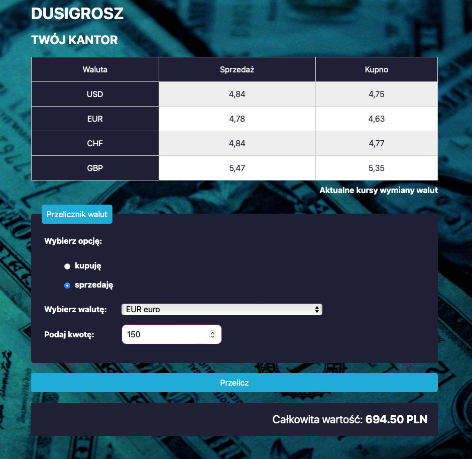

# Currency Exchange Calculator Project

## Description

Simple currency exchange calculator. In this project I use BEM convention in CSS and some functions in JavaScript with ECMAScript 6 standard.

## Screenshot

## DEMO

https://przema.github.io/currencyExchangeProject/
